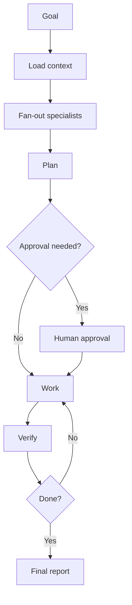

# AI Engineering Operating System Wiki

Welcome to the AI-OS wiki.

The wiki is a curated browsing surface. The canonical source of truth remains in the repository docs.

## Main pages

- [Master Operating Manual](../docs/ai-os/master-operating-manual.md)
- [Continuous Improvement Loop](../docs/methodology/continuous-improvement-loop.md)
- [Mermaid Diagram Catalog](../docs/diagrams/README.md)
- [Loop Catalog](../docs/loops/README.md)
- [Verification Gates](../docs/verifiers/README.md)
- [Prompt Templates](../prompts/README.md)
- [Architecture Guide](Architecture-Guide.md)
- [Loops](Loops.md)
- [Verifiers](Verifiers.md)
- [Prompts](Prompts.md)
- [Releases](Releases.md)

## What this is

AI-OS is a repeatable operating framework for AI coding agents.

