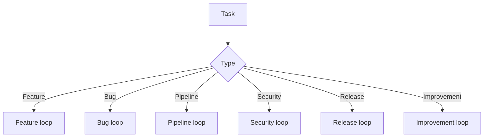

# Loops

Canonical loop docs are in docs/loops.

## Loop map

## Pages

- docs/loops/README.md
- docs/loops/feature.md
- docs/loops/bugfix-loop.md
- docs/loops/pipeline-repair.md
- docs/loops/security.md
- docs/loops/release.md
