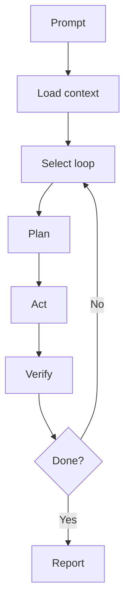

# Prompts

Canonical prompt docs are in prompts.

## Recommended prompts

- prompts/master-system-prompt.md
- prompts/chatgpt-web.md
- prompts/feature.md
- prompts/bugfix.md
- prompts/continuous-improvement.md

## Prompt loop

