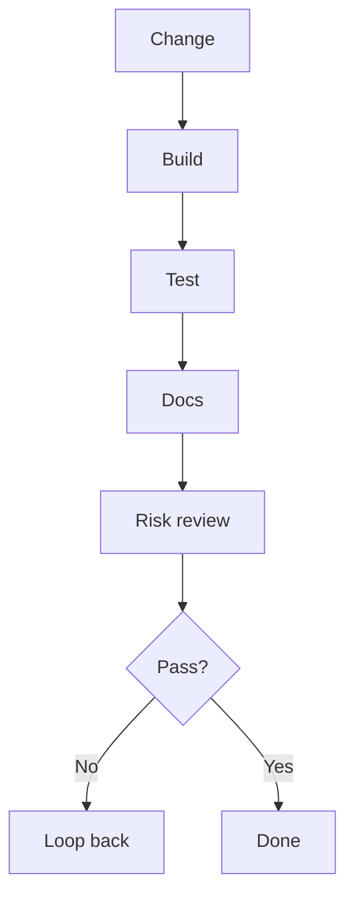

# Verifiers

Canonical verifier docs are in docs/verifiers.

## Gate flow

```mermaid
flowchart TD
    Change[Change] --> Build[Build]
    Build --> Test[Test]
    Test --> Docs[Docs]
    Docs --> Risk[Risk review]
    Risk --> Pass{Pass?}
    Pass -- No --> Loop[Loop back]
    Pass -- Yes --> Done[Done]
```

## Pages

- docs/verifiers/README.md
- docs/methodology/definition-of-done.md
